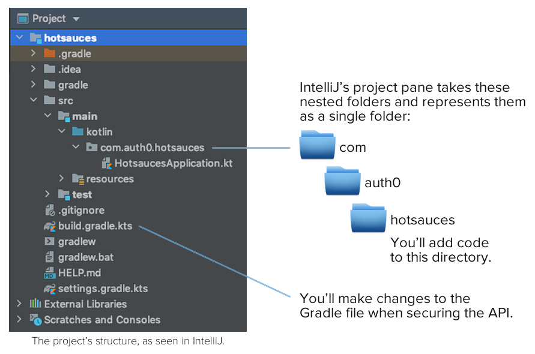

# Build and Secure an API with Spring Boot, Kotlin, and Auth0

Learn how to write a Spring Boot API in Kotlin and secure it with Auth0.


**TL;DR:** In this article, you’ll learn how to quickly build a RESTful API using the Spring Boot framework and the Kotlin programming language. Once you’ve done that, you’ll use Auth0 to secure the API so that only authenticated parties can   use its key functions. Along the way, you’ll learn the principles behind OAuth2, the protocol that powers Auth0. You can find the final code for the project developed throughout this article in [this GitHub repository](https://github.com/AccordionGuy/HotSauces).


## Spring Framework, Spring Boot, and Kotlin: An Overview

### Spring Framework


[Spring Framework](https://spring.io/projects/spring-framework), often shortened to just “Spring”, is a popular open source application framework for the Java platform. It’s built on the principle of [inversion of control](https://dzone.com/articles/understanding-inversion-of-control-and-dependency), whose name implies that control of a Spring application is quite different from the way program control happens in traditional software. Instead of your code directing the application and calling on functionality from a library or framework, the framework directs the application and calls on the functionality of your code.

This approach makes it possible to write an application as a collection of components, and the connections between them are maintained by Spring. There are also a lot of ready-built Spring components called *dependencies* that provide functionality that applications commonly require. The end result is a system for building applications that are modular, flexible, and easy to maintain — and in less time.

Spring is often described — especially by Java developers, who’ve grown used to working with unwieldy frameworks — as lightweight. It provides a set of built-in often-needed capabilities such as MVC, caching, messaging, security, and especially data access. It significantly reduces the amount of code you have to write and lets you focus on the features that are unique to your application.

While Spring is often used for web and server-based applications, it’s a general application framework, and it can be used to write desktop and mobile applications as well.

### Spring Boot


[Spring Boot](https://spring.io/projects/spring-boot) is a framework built on top of Spring that simplifies Spring development. It does this by enforcing an [opinionated](https://www.quora.com/What-is-a-Opinionated-Framework) approach to Spring application development through [“convention over configuration”](https://facilethings.com/blog/en/convention-over-configuration), the use of default setups that applications are likely to use, and a standardized application structure created by a generator that goes by the decidedly “Web 2.0” name of [Spring Initializr](https://www.tiobe.com/tiobe-index/). Thanks to its “it just works” approach, it’s propbably the fastest way to develop applications with the Spring framework.

### Kotlin


[Kotlin](https://kotlinlang.org/) is part of the wave of programming languages that appeared in the 2010s, which includes [Dart](https://dart.dev/), [Go](https://golang.org/), [Rust](https://www.rust-lang.org/), and [Swift](https://developer.apple.com/swift/). These languages have a number of common traits including their own takes on object-oriented programming from the lessons of the 1990s and functional programming from the lessons of the 2000s, inferred strong static typing, and meteoric rises in popularity (all of them are in [TIOBE’s index of popular programming languages](https://www.tiobe.com/tiobe-index/), and all of them except Kotlin are in the top 20).

As a programming language designed by [a company that makes developer tools](https://developer.apple.com/swift/), Kotlin is unique in its origin. It was designed to be an [improvement on Java](https://kotlinlang.org/docs/reference/comparison-to-java.html), with all the language features of [Scala](https://www.scala-lang.org/) (but faster compile times) and with the power and convenience that comes from interoperability with Java and the Java platform. It has grown to become the preferred language for Android app development; two-thirds of the top 1,000 Play Store apps were written in Kotlin. It’s also making serious inroads into web and enterprise development territory.

Since Spring and Spring Boot are based on the Java platform, you can use them to build applications using any JVM-based programming language, which includes Kotlin. If Java’s verbosity is bringing you down, or if you’re an Android developer who wants to use the same language to write the back end for your app, Spring and Spring Boot development in Kotlin is for you!


## What You’ll Build: A Hot Sauce API


The API you’ll build will be a catalog of hot sauces. It will be a simple one, exposing just a single resource named **hotsauces**. 

The API will provide endpoints for:

* Confirming that the API is active
* Getting a list of all the hot sauces in the catalog
* Getting the number of hot sauces in the catalog
* Adding a hot sauce to the catalog
* Editing any hot sauce in the catalog
* Deleting a hot sauce from the catalog

In the first part of the project, you’ll build the API. Once built, you’ll secure it so that the endpoints for CRUD operations will require authentication, while the endpoint for testing to see if the API is active will remain public.


## Prerequisites

To follow along with this article, you’ll need the following installed on your local machine:

* **[JDK 11](https://www.oracle.com/java/technologies/javase-jdk11-downloads.html)**
* The [curl](https://curl.haxx.se/) command line tool 
* Your favorite code editor

You’ll also need internet access, as you’ll be using the Spring Initializr web page and the [Gradle](https://gradle.org/) build tool, which goes online to download project dependencies.


## Building the API

### Scaffolding with Spring Initializr

The preferred way to set up a new Spring Boot project is to use **[Spring Initializr](start.spring.io)**, a web application that generates a basic Spring Boot project, complete with all the necessary configurations, your choice of dependencies, and Gradle or Maven build files. It’s available online at [start.spring.io](https://start.spring.io/) and built into the Ultimate Edition of [IntelliJ IDEA](https://www.jetbrains.com/idea/).

You *could* create a new project manually using Spring Boot’s command-line interface, but Spring Initializr organizes its projects using a standardized directory layout for JVM-based projects. This makes your projects easier to maintain, and lets you focus on what your application actually *does*.

Point your favorite browser at the [Spring Initializr page](https://start.spring.io/):


Here’s how you should fill it out:

* *Project:* Select **Gradle Project**.
* *Language:* Select **Kotlin**.
* *Spring Boot:* Select **2.3.3**.
* *Project Metadata:*
	* *Group:* Enter **com.auth0**.
	* *Artifact:* Enter **hotsauces**.
	* *Name:* This will autofill; just use the value in this field.
	* *Description:* 
	* *Package name:* This will autofill; just use the value in this field.
	* *Packaging:* Select **Jar**.
	* *Java:* Select **11**.
* *Dependencies:* Tap the **ADD DEPENDENCIES...** button and choose the following:
	* **Spring Boot DevTools**: A set of convenient tools for development.
	* **Spring Web**: Provides a web server and facilities for building RESTfulweb applications and APIs.
	* **Spring Data JPA**: Makes the process of building a data access layer almost trivial.
	* **H2 Database**: This project will use the [H2](https://www.h2database.com/html/main.html) in-memory database.

Once filled out, the form should look like this:


With the form filled out, tap the **GENERATE** button. The site will generate a .zip file, which  and it will automatically be downloaded to your local machine.

Unzip the file to reveal the **hotsauces** project folder:



You’ll work in two specific areas of the project in this exercise:

* **./src/main/kotlin/com/auth0/hotsauces/**: The project code goes into this directory. At the moment, it contains a single file, **HotSaucesApplication.kt**. This contains a simple application class, which is the first project code that is executed when the application is run. You’ll add code to this directory.
* **./build.gradle.kts**: The Gradle build file. Among other things, it specifies which dependencies will be used by the project. You’ll add some security-related dependencies to this file when securing the API.


### Defining `HotSauces`, the Class Behind the API’s Resource


The first piece of code you’ll write is the model behind the API’s only resource — hot sauces.

Each hot sauce has the following attributes:

<table>
	<tr>
		<th>Attribute</th>
		<th>Type</th>
		<th>Description</th>
	</tr>
	<tr>
		<td><strong><code>id</code></strong></td>
		<td>number</td>
		<td>The unique identifier for the hot sauce, and primary key.</td>
	</tr>
	<tr>
		<td><strong><code>brandName</code></strong></td>
		<td>string</td>
		<td>The name of the producer of the hot sauce.</td>
	</tr>
	<tr>
		<td><strong><code>sauceName</code></strong></td>
		<td>string</td>
		<td>The name of the hot sauce.</td>
	</tr>
	<tr>
		<td><strong><code>description</code></strong></td>
		<td>string</td>
		<td>A description of the hot sauce, with the appropriate keywords. This may be lengthy.</td>
	</tr>
	<tr>
		<td><strong><code>url</code></strong></td>
		<td>number</td>
		<td>The URL for the web page for the hot sauce.</td>
	</tr>
	<tr>
		<td><strong><code>heat</code></strong></td>
		<td>number</td>
		<td>The spiciness of the hot sauce, expressed in <a href="https://pepperheadsforlife.com/the-scoville-scale/">Scoville heat units (SHUs).</a></td>
	</tr>
</table>

Create a new file named **HotSauce.kt** in the **./src/main/kotlin/com/auth0/hotsauces/** directory:

```
// ./src/main/kotlin/com/auth0/hotsauces/HotSauce.kt

package com.auth0.hotsauces

import javax.persistence.Entity
import javax.persistence.GeneratedValue
import javax.persistence.GenerationType
import javax.persistence.Id
import javax.persistence.Lob


@Entity
data class HotSauce(

    // This property maps to the primary key in the database.
    @Id @GeneratedValue(strategy = GenerationType.AUTO)
    val id: Long = 0,

    // These properties are likely NOT to be longer than 256 characters.
    var brandName: String = "",
    var sauceName: String = "",

    // These properties might be longer than 256 characters.
    @Lob
    var description: String = "",
    @Lob
    var url: String = "",

    var heat: Int = 0

)
```

`HotSauce` is a Kotlin **[data class](https://kotlinlang.org/docs/reference/data-classes.html)**, whose job is to hold data. Data classes are all properties and no methods — or at least no explicitly defined methods, anyway. The compiler automatically provides a handful of “behind the scenes” methods, including `equals()`, `hashCode()`, and `toString()`.

Kotlin classes, data classes included, have a constructor build into the class header. This constructor, called the **primary constructor**, takes its parameters in the parentheses that follow the class name. `HotSauce`, like many data classes,  is just a class header and primary costructor, and nothing else.

Even though there isn’t much to the class, it has uses some annotations to pull in a lot of extra functionality:

* `HotSauce` is annotated with `@Entity`, which informs the Java Persistence API (JPA, one of the dependencies that you added in Spring Initializr) that its instances will be persisted in the database.
* The `id` property is annotated with both `@Id` and `@GeneratedValue`, which makes sense, as it will map to to the `id` field in the corresponding database table.
* The `@Lob` annotation is short for “large object,” and it’s used to annotate the `description` and `url` properties because they could contain strings longer than 256 characters. By default, JPA maps `String`s in entities to the `VARCHAR(256)` type in the database; marking a `String` as `@Lob` tells JPA to map it to the `TEXT` type instead.

With `HotSauce` defined, you have a **model** that represents hot sauces in the real world. By annotating it with `@Entity`, you’ve specified that instances of `HotSauce` should be converted into **entities** — that is, instances that have been saved to a database.

It’s time to set up something to save `HotSauce` instances.


### Adding Data Access with a `CrudRepository`

The [Repository pattern](https://deviq.com/repository-pattern/) provides a layer of abstraction between an application’s models and the system used to store data. A repository provides a collection-style interface to the models, with methods for retrieving the whole collection, retrieving a specific item, and adding, editing, and deleting items. The repository insulates the models from the usual database concerns, such as connecting with it, setting up a reader, or worrying about things like cursors.

Spring provides a number of repository interfaces. In this project, you’ll use the [`CrudRepository`](https://docs.spring.io/spring-data/commons/docs/current/api/org/springframework/data/repository/CrudRepository.html) interface to act as the intermediary between `HotSauce` and the H2 database (another one of the dependencies you added in Spring Initializr) as shown below:


In this exercise, the underlying data store is the H2 in-memory database. The Repository pattern makes it so that changing the database doesn’t require you to make any changes to `HotSauce`, and Spring’s inversion of control architecture makes it so that such a change doesn’t even require a change to the `CrudRepository`.

Create a new file named **HotSauceRepository.kt** in the **./src/main/kotlin/com/auth0/hotsauces/** directory:

```
// ./src/main/kotlin/com/auth0/hotsauces/HotSauceRepository.kt

package com.auth0.hotsauces

import org.springframework.data.repository.CrudRepository


interface HotSauceRepository: CrudRepository<HotSauce, Long>
```

This code sets up an interface named `HotSauceRepository` that’s based on a `CrudRepository` of entities based on the `HotSauce` model, each of which is uniquely identified by a `Long` (namely, the `id` property of `HotSauce`).

`CrudRepository` provides a set of methods for performing the standard set of CRUD operations. Here’s the subset that you’ll use in this project:

<table>
	<tr>
		<th>Method</th>
		<th>Description</th>
	</tr>
	<tr>
		<td><code><strong>count()</strong></code></td>
		<td>Returns the number of entities.</td>
	</tr>
	<tr>
		<td><code><strong>deleteById({id})</strong></code></td>
		<td>Deletes the entity with the given id.</td>
	</tr>
	<tr>
		<td><code><strong>existsById({id})</strong></code></td>
		<td>Returns `true` if the entity with the given id exists.</td>
	</tr>
	<tr>
		<td><code><strong>findAll()</strong></code></td>
		<td>Retrieves all the entities.</td>
	</tr>
	<tr>
		<td><code><strong>findById({id})</strong></code></td>
		<td>Retrieves the entity with the given id.</td>
	</tr>
	<tr>
		<td><code><strong>save()</strong></code></td>
		<td>Saves the given entity.</td>
	</tr>
</table> 

You’ll use these methods in the controller, which you’ll build next.

Note that you didn’t have to do anything to connect the repository to the database. Spring Boot’s inversion of control took are of that for you.


### Building the controller

The controller should expose the following API endpoints:

<table>
	<tr>
		<th>API endpoint</th>
		<th>Description</th>
	</tr>
	<tr>
		<td><code><strong>GET api/hotsauces/test</strong></code></td>
		<td>Simply returns the text **Yup, it works!**</td>
	</tr>
	<tr>
		<td><code><strong>GET api/hotsauces</strong></code></td>
		<td>
			<p>Returns the entire collection of hot sauces.</p>
			<p>Accepts these optional parameters:</p>
			<ul>
				<li><code>brandNameFilter:</code> Limits the results
					to only those sauces whose `brandName` contains
					the given string.</li>
				<li><code>sauceNameFilter:</code> Limits the results
					to only those sauces whose `sauceName` contains
					the given string.</li>
				<li><code>descFilter:</code> Limits the results
					to only those sauces whose `description` contains
					the given string.</li>
				<li><code>minHeat:</code> Limits the results
					to only those sauces whose `heat` rating 
					is greater than or equal to the given number.</li>
				<li><code>maxHeat:</code> Limits the results
					to only those sauces whose `heat` rating 
					is less than or equal to the given number.</li>
			</ul>
		</td>
	</tr>
	<tr>
		<td><code><strong>GET api/hotsauces/{id}</strong></code></td>
		<td>Returns the hot sauce with the given id.</td>
	</tr>
	<tr>
		<td><code><strong>GET api/hotsauces/count</strong></code></td>
		<td>Returns the number of hot sauces.</td>
	</tr>
	<tr>
		<td><code><strong>POST api/hotsauce</strong></code></td>
		<td>Adds the hot sauce (provided in the request).</td>
	</tr>
	<tr>
		<td><code><strong>PUT api/hotsauces/{id}</strong></code></td>
		<td>Edits the hot sauce with the given id and saves the edited hot sauce.</td>
	</tr>
	<tr>
		<td><code><strong>DELETE api/hotsauces/{id}</strong></code></td>
		<td>Deletes the hot sauce with the given id.</td>
	</tr>
</table> 

Create a new file named **HotSauceController.kt** in the **./src/main/kotlin/com/auth0/hotsauces/** directory:

```
// ./src/main/kotlin/com/auth0/hotsauces/HotSauceController.kt

package com.auth0.hotsauces

import org.springframework.http.HttpStatus
import org.springframework.http.ResponseEntity
import org.springframework.web.bind.annotation.*
import java.util.*


@RestController
@RequestMapping("/api/hotsauces")
class HotSauceController(private val hotSauceRepository: HotSauceRepository) {

    @GetMapping("/test")
    fun getHotSauce(): ResponseEntity<String> = ResponseEntity("Yup, it works!",  HttpStatus.OK)

    @GetMapping("")
    fun getAll(@RequestParam(required = false, defaultValue = "") brandNameFilter: String,
               @RequestParam(required = false, defaultValue = "") sauceNameFilter: String,
               @RequestParam(required = false, defaultValue = "") descFilter: String,
               @RequestParam(required = false, defaultValue = "") minHeat: String,
               @RequestParam(required = false, defaultValue = "") maxHeat: String): ResponseEntity<List<HotSauce>> {
        val MAX_SCOVILLE = 3_000_000 // At this point, it's no longer food, but a weapon
        val minHeatFilter = if (minHeat != "") minHeat.toInt() else 0
        val maxHeatFilter = if (maxHeat != "") maxHeat.toInt() else MAX_SCOVILLE
        return ResponseEntity(hotSauceRepository.findAll()
                .filter { it.brandName.contains(brandNameFilter, true) }
                .filter { it.sauceName.contains(sauceNameFilter, true) }
                .filter { it.description.contains(descFilter, true) }
                .filter { it.heat >= minHeatFilter }
                .filter { it.heat <= maxHeatFilter },
                HttpStatus.OK
        )
    }

    @GetMapping("/count")
    fun getCount(): ResponseEntity<Long> = ResponseEntity(hotSauceRepository.count(),
            HttpStatus.OK)

    @GetMapping("/{id}")
    fun getHotSauce(@PathVariable id: Long): ResponseEntity<Optional<HotSauce>> {
        if (hotSauceRepository.existsById(id)) {
            return ResponseEntity(hotSauceRepository.findById(id), HttpStatus.OK)
        } else {
            return ResponseEntity(HttpStatus.NOT_FOUND)
        }
    }

    @PostMapping()
    fun createHotSauce(@RequestBody hotSauce: HotSauce): ResponseEntity<HotSauce> {
        return ResponseEntity(hotSauceRepository.save(hotSauce), HttpStatus.CREATED)
    }

    @PutMapping("/{id}")
    fun updateHotSauce(@PathVariable id: Long, @RequestBody sauceChanges: HotSauce): ResponseEntity<HotSauce?> {
        if (hotSauceRepository.existsById(id)) {
            val originalSauce = hotSauceRepository.findById(id).get()
            val updatedSauce = HotSauce(
                    id = id,
                    brandName = if (sauceChanges.brandName != "") sauceChanges.brandName else originalSauce.brandName,
                    sauceName = if (sauceChanges.sauceName != "") sauceChanges.sauceName else originalSauce.sauceName,
                    description = if (sauceChanges.description != "") sauceChanges.description else originalSauce.description,
                    url = if (sauceChanges.url != "") sauceChanges.url else originalSauce.url,
                    heat = if (sauceChanges.heat != 0) sauceChanges.heat else originalSauce.heat
            )
            return ResponseEntity(hotSauceRepository.save(updatedSauce), HttpStatus.OK)
        } else {
            return ResponseEntity(HttpStatus.NOT_FOUND)
        }
    }

    @DeleteMapping("/{id}")
    fun deleteHotSauce(@PathVariable id: Long): ResponseEntity<HotSauce?> {
        if (hotSauceRepository.existsById(id)) {
            hotSauceRepository.deleteById(id)
            return ResponseEntity(HttpStatus.NO_CONTENT)
        } else {
            return ResponseEntity(HttpStatus.NOT_FOUND)
        }
    }

}
```

The code’s considerably less complex that it could be, thanks to some annotations which take care of a lot of tedious REST work:

* `HotSauceController` is annotated with `@RestController`, which informs that Spring Web (yet another one of the dependencies that you added in Spring Initializr) that this class is a REST controller and that it should include the neessary underlying REST functionality.
* `HotSauceController` is also annotated with `@RequestMapping("/api/hotsauces")` which means that every method in the class that responds to a request responds to requests whose endpoint begins with `api/hotsauces`.
* Any method annotated with `@GetMapping()` responds to `GET` requests. If `@GetMapping()` takes a parameter, it means that it responds to requests whose endpoint begins with that parameter. Parameters in braces (`{` and `}`) are variable parameters.
* Any method annotated with `@PostMapping()`, `@PutMapping()`, and `@DeleteMapping` is similar to methods, annotated with `@GetMapping()`, except that they respond to `POST`, `PUT`, and `DELETE` requests respectively.


### Initializing the database

You could run the app now and it would work. There’s just one problem: Since the database in in-memory and unitialized, you don’t have any data to work with! Let’s add a class to preload the database with some initial hot sauces.

Create a new file named **DataLoader.kt** in the **./src/main/kotlin/com/auth0/hotsauces/** directory:

```
// ./src/main/kotlin/com/auth0/hotsauces/DataLoader.kt

package com.auth0.hotsauces

import org.springframework.stereotype.Component
import javax.annotation.PostConstruct


@Component
class DataLoader(var hotSauceRepository: HotSauceRepository) {

    fun String.trimIndentsAndRemoveNewlines() = this.trimIndent().replace("\n", " ")

    @PostConstruct
    fun loadData() {
        hotSauceRepository.saveAll(listOf(
            HotSauce(
                brandName = "Truff",
                sauceName = "Hot Sauce",
                description = """
                    Our sauce is a curated blend of ripe chili peppers, organic agave nectar, black truffle, and 
                    savory spices. This combination of ingredients delivers a flavor profile unprecedented to hot sauce.
                    """.trimIndentsAndRemoveNewlines(),
                url = "https://truffhotsauce.com/collections/sauce/products/truff",
                heat = 2_500
            ),
            HotSauce(
                brandName = "Truff",
                sauceName = "Hotter Sauce",
                description = """
                    TRUFF Hotter Sauce is a jalapeño rich blend of red chili peppers, Black Truffle and Black Truffle 
                    Oil, Organic Agave Nectar, Red Habanero Powder, Organic Cumin and Organic Coriander. Perfectly 
                    balanced and loaded with our same iconic flavor, TRUFF Hotter Sauce offers a “less sweet, more heat”
                    rendition of the Flagship original.
                    """.trimIndentsAndRemoveNewlines(),
                url = "https://truffhotsauce.com/collections/sauce/products/hotter-truff-hot-sauce",
                heat = 4_000
            ),
            HotSauce(
                brandName = "Cholula",
                sauceName = "Original",
                description = """
                    Cholula Original Hot Sauce is created from a generations old recipe that features carefully-selected
                    arbol and piquin peppers and a blend of signature spices. We love it on burgers and chicken but have
                    heard it’s amazing on pizza. Uncap Real Flavor with Cholula Original.
                    """.trimIndentsAndRemoveNewlines(),
                url = "https://www.cholula.com/original.html",
                heat = 3_600
            ),
            HotSauce(
                brandName = "Mad Dog",
                sauceName = "357",
                description = """
|                   Finally, a super hot sauce that tastes like real chile peppers. This sauce is blended
|                   with ingredients that create a sauce fit to take your breath away. About five seconds after you 
|                   taste the recommended dose of one drop, prepare your mouth and mind for five to 20 minutes of agony
|                   that all true chileheads fully understand and appreciate.
|                   """.trimIndentsAndRemoveNewlines(),
                url = "https://www.saucemania.com.au/mad-dog-357-hot-sauce-148ml/",
                heat = 357_000
            ),
            HotSauce(
                brandName = "Hot Ones",
                sauceName = "Fiery Chipotle",
                description = """
                    This hot sauce was created with one goal in mind: to get celebrity interviewees on Hot Ones to say 
                    "damn that's tasty, and DAMN that's HOT!" and then spill their deepest secrets to host Sean Evans.
                    The tongue tingling flavors of chipotle, pineapple and lime please the palate while the mix of ghost
                    and habanero peppers make this sauce a scorcher. Hot Ones Fiery Chipotle Hot Sauce is a spicy
                    masterpiece.
                    """.trimIndentsAndRemoveNewlines(),
                url = "https://chillychiles.com/products/hot-ones-fiery-chipotle-hot-sauce",
                heat = 15_600
            ),
            HotSauce(
                brandName = "Hot Ones",
                sauceName = "The Last Dab",
                description = """
                    More than simple mouth burn, Pepper X singes your soul. Starting with a pleasant burn in the mouth,
                    the heat passes quickly, lulling you into a false confidence. You take another bite, enjoying the
                    mustard and spice flavours. This would be great on jerk chicken, or Indian food! But then, WHAM!
                    All of a sudden your skin goes cold and your stomach goes hot, and you realize the power of X.
                    """.trimIndentsAndRemoveNewlines(),
                url = "https://www.saucemania.com.au/hot-ones-the-last-dab-hot-sauce-148ml/",
                heat = 1_000_000
            ),
            HotSauce(
                brandName = "Torchbearer",
                sauceName = "Zombie Apocalypse",
                description = """
                    The Zombie Apocalypse Hot Sauce lives up to its name, combining Ghost Peppers and Habaneros with a
                    mix of spices, vegetables, and vinegar to create a slow burning blow torch. Some people will feel
                    the heat right away, but others can take a few minutes for the full impact to set in. The heat can
                    last up to 20 minutes, creating a perfect match between very high heat and amazing flavor. Try it
                    on all your favorite foods - wings, chili, soups, steak or even a sandwich in need of a major kick.
                    """.trimIndentsAndRemoveNewlines(),
                url = "https://heatonist.com/products/zombie-apocalypse",
                heat = 100_000
            ),
            HotSauce(
                brandName = "Heartbeat",
                sauceName = "Pineapple Habanero",
                description = """
                    Pineapple Habanero is Heartbeat Hot Sauce’s most recent offering and their spiciest to date! They’ve
                    yet again collaborated with an Ontario craft brewery, this time from their home town of Thunder Bay.
                    Made with the help of Sleeping Giant Brewery’s award winning Beaver Duck session IPA, this sauce has
                    a boldly pronounced fruitiness and a bright but savoury vibe from start to finish.
                    """.trimIndentsAndRemoveNewlines(),
                url = "https://www.saucemania.com.au/heartbeat-pineapple-habanero-hot-sauce-177ml/",
                heat = 12_200
            ),
            HotSauce(
                brandName = "Karma Sauce",
                sauceName = "Burn After Eating",
                description = """
                    Karma Sauce Burn After Eating Hot Sauce is imbued with a unique flavour thanks to green mango,
                    ajwain and hing powder. Forged with a top-secret blend of super hots that may or may not include
                    Bhut Jolokia (Ghost), Scorpion, Carolina Reaper, 7-Pot Brown and 7-Pot Primo. This isn’t a sauce you
                    eat, it’s one you survive.
                    """.trimIndentsAndRemoveNewlines(),
                url = "https://www.saucemania.com.au/karma-sauce-burn-after-eating-hot-sauce-148ml/",
                heat = 669_000
            )
        ))
    }

}
```

This class has a couple of annotations:

* `DataLoader` is annotated with `@Component`, which marks it so that Spring will autodetect the class when it’s needed. Since the code in this class references the  application’s instance of `HotSauceRepository`, this class will be instantiated when an instance of `HotSauceRepository` is created.
* The `loadData()` method is annotated with `@PostConstruct`, which specifies that it should be called as soon as the class has been initialized.


#### Kotlin Extensions

This class also makes use of a handy Kotlin feature: **[Extensions](https://kotlinlang.org/docs/reference/extensions.html)**. These are properties or functions that can be added to classes to extend their capabilities without having to access their code or somehow decorate them.

At the beginning of the class, you added an extension to the `String` class:

```
fun String.trimIndentsAndRemoveNewlines() = this.trimIndent().replace("\n", " ")
```

This adds the method `trimIndentsAndRemoveNewlines()` to the `String` class, which removes indentations and newline characters from multiline strings. The assignments to each hot sauce’s `description` property is done using multiline strings (which are delimited with triple-quotes — `"""`) to make the code easier to read.


## Trying out the API

You’re now ready to take the API for a trial run. To run the application, open a terminal, go to the application’s directory and enter the following command:

```
./gradlew bootRun
```

This command was included in the set of files that Spring Initilizr generated. It sets Gradle in motion, causing it to download any needed plugins and dependencies, after which it launches the application. 

When it starts, you’ll see a lot of output, beginning with this:

```
  .   ____          _            __ _ _
 /\\ / ___'_ __ _ _(_)_ __  __ _ \ \ \ \
( ( )\___ | '_ | '_| | '_ \/ _` | \ \ \ \
 \\/  ___)| |_)| | | | | || (_| |  ) ) ) )
  '  |____| .__|_| |_|_| |_\__, | / / / /
 =========|_|==============|___/=/_/_/_/
 :: Spring Boot ::        (v2.3.3.RELEASE)
```

A lot of status messages will scroll by, but eventually the scrolling will end, and you’ll see this will end with this:

```
> :bootRun
```

If you don’t see an error message and the last line of the output is > :bootRun, it means that the project is running properly and listening to **localhost:8080** for incoming requests. You can now start making API calls.


### Is this thing on?

Start by confirming that sending a GET request to the test endpoint results in a “Yup, it works!” response.

Open a new terminal and enter the following:

```
$ curl http://localhost:8080/api/hotsauces/test
```

This should be the response:

```
Yup, it works!
```


### Count hot sauces

Send a GET request to the `/api/hotsauces/count` endpoint to get the current number of hot sauces in the database:

```
$ curl http://localhost:8080/api/hotsauces/count
```

If you haven’t added or removed any hot sauces since starting the application, the API should report that there are 9:

```
9
```


### List hot sauces

To get the complete list of hot sauces, send a GET request to `/api/hotsauces`:

```
$ curl http://localhost:8080/api/hotsauces/
```

The response will be a JSON array of dictionaries, with each dictionary representing a hot sauce.

```
[{"id":1,"brandName":"Truff","sauceName":"Hot Sauce","

...

"url":"https://www.saucemania.com.au/karma-sauce-burn-after-eating-hot-sauce-148ml/","heat":669000}]
```

Try using the optional parameters to limit the results. In the example below, the maxHeat parameter is being used to limit the response to hot sauces with a Scoville rating of 10,000 or less:

```
$ curl http://localhost:8080/api/hotsauces?maxHeat=10000
```

If you haven’t added or removed any hot sauces since starting the application, the API should return a list of three hot sauces:

```
[{"id":1,"brandName":"Truff","sauceName":"Hot Sauce","description":"Our sauce is a curated blend of ripe chili peppers, organic agave nectar, black truffle, and  savory spices. This combination of ingredients delivers a flavor profile unprecedented to hot sauce.","url":"https://truffhotsauce.com/collections/sauce/products/truff","heat":2500},{"id":2,"brandName":"Truff","sauceName":"Hotter Sauce","description":"TRUFF Hotter Sauce is a jalapeño rich blend of red chili peppers, Black Truffle and Black Truffle  Oil, Organic Agave Nectar, Red Habanero Powder, Organic Cumin and Organic Coriander. Perfectly  balanced and loaded with our same iconic flavor, TRUFF Hotter Sauce offers a “less sweet, more heat” rendition of the Flagship original.","url":"https://truffhotsauce.com/collections/sauce/products/hotter-truff-hot-sauce","heat":4000},{"id":3,"brandName":"Cholula","sauceName":"Original","description":"Cholula Original Hot Sauce is created from a generations old recipe that features carefully-selected arbol and piquin peppers and a blend of signature spices. We love it on burgers and chicken but have heard it’s amazing on pizza. Uncap Real Flavor with Cholula Original.","url":"https://www.cholula.com/original.html","heat":3600}]
```


### Add a new hot sauce

Add a new sauce to the database by sending a POST request to `/api/hotsauces/`, along with the attributes of the new sauce — except `id`, which will automatically be assigned to the new sauce — in JSON dictionary form:

```
$ curl --request POST \
  --url http://localhost:8080/api/hotsauces/ \
  -H "Content-Type: application/json" \
  --data '{"brandName": "Dave’s Gourmet", "sauceName": "Temporary Insanity", "url": "https://store.davesgourmet.com/ProductDetails.asp?ProductCode=DATE", "description": "This sauce has all the flavor of Dave’s Original Insanity with less heat. Finally, there’s sauce for when you only want to get a little crazy in the kitchen. Add to stews, burgers, burritos, and pizza, or any food that needs an insane boost. As with all super hot sauces, this sauce is best enjoyed one drop at a time!", "heat": 57000}'
```

The hot sauce will be added to the database, and the API will respond with a JSON dictionary containing all its attributes, including the `id` assigned to it:

```
{"id":10,"brandName":"Dave’s Gourmet","sauceName":"Temporary Insanity","description":"This sauce has all the flavor of Dave’s Original Insanity with less heat. Finally, there’s sauce for when you only want to get a little crazy in the kitchen. Add to stews, burgers, burritos, and pizza, or any food that needs an insane boost. As with all super hot sauces, this sauce is best enjoyed one drop at a time!","url":"https://store.davesgourmet.com/ProductDetails.asp?ProductCode=DATE","heat":57000}
```

You can confirm that the hot sauce has been added to the database by requesting the complete list, or by requesting it by id.


### Edit a hot sauce

Make changes to a hot sauce in the database by sending a PUT request to `/api/hotsauces/{id}` where `{id}` is the hot sauce’s `id` value, along with the attributes you wish to change in JSON dictionary form: 

```
$ curl --request PUT \
  --url http://localhost:8080/api/hotsauces/10 \
  -H "Content-Type: application/json" \
  --data '{"brandName": "NewCo", "sauceName": "Generic Hot Sauce", "description": "It’s hot. It’s sauce. That’s it.", "heat": 1000}'
```

The hot sauce will be updated with your changes, and the API will respond with a JSON dictionary containing the updated hot sauce’s attributes:

```
{"id":10,"brandName":"NewCo","sauceName":"Generic Hot Sauce","description":"It’s hot. It’s sauce. That’s it.","url":"https://store.davesgourmet.com/ProductDetails.asp?ProductCode=DATE","heat":1000}
```


### Delete a hot sauce

Delete a hot sauce by sending a DELETE request to `/api/hotsauces/{id}` where `{id}` is the hot sauce’s `id` value:

```
curl --request DELETE \
  --url http://localhost:8080/api/hotsauces/10
```

You can confirm that the hot sauce has been removed from the database by requesting the complete list.


## Securing the API

Right now, the entire API is unsecured. All its endpoints are available to anyone with the URL and the ability to send HTTP requests.

Suppose that we want to allow only authorized applications to have access to the endpoints of the API that allow accessing, adding, editing, and deleting hot sauces. The remaining endpoints — the test endpoint and the one that reports the number of hot sauces — can remain generally available.

You’ll use Auth0 to secure the API’s CRUD endpoints, but before that happens, let’s take a look at how API authentication works.


## Setting Up API Authentication on the Auth0 Side

### Registering the API

At this point, you’ll need to log into Auth0. (If you don’t have one yet, you can [sign up for a free Auth0 account](https://auth0.com/signup).)

Once you’ve logged in, [navigate to the *APIs* page](https://manage.auth0.com/?&_ga=2.55268258.821728906.1599742219-782382229.1597890849#/apis)...


...and tap the **CREATE API** button located near the upper right corner of the page. A form will appear, asking for basic information about the API:


Fill it out like so:

* *Name:* Enter **HotSauces**.
* *Identifier:* Enter **http://hotsauces.demo**.
* *Signing Algorithm:* Select **RS256**.

When you’re done providing this information, tap the **CREATE** button. The API will be registered in Auth0.


### Getting an Access Token

You’ll be taken to the API’s newly registered **Quick Start** page, pictured below:


Tap on **Machine to Machine Applications**, which will take you to this page:


This is the first of two pages that provide information that you need in order to get the access token. 

You’ll be copying four items, and you may find it helpful to open a text editor so that you have some place in which to paste them.

Copy the API Identifier, which is located just below the page’s headline, and paste it into the text editor.

Your text editor should look something like this:

```
API Identifier: {API Identifier}
```

If you’ve been following the steps in this exercise, {API Identifier} will be **http://hotsauces.demo**.

There will be a list of applications at the bottom of the page. One of them will be **HotSauces**. Tap on its name. You’ll be taken to HotSauces’ **Machine to Machine → Settings** page, which contains information that you’ll need to get the token:


Use the “copy” buttons on the right side of these fields to copy and paste their contents into the same text editor where you pasted the API Identifier:

* Domain
* Client ID
* Client Secret

Your text editor should now look something like this:

```
API Identifier: {API Identifier}
Domain: {Domain}
Client ID: {Client ID}
Client Secret: {Client Secret}
```

You now have the necessary pieces of information needed to request a token. You’ll request the token by sending a POST request containing the information.

You might find it easier to assemble the POST request in the same text editor where you pasted the information.

Start with this cURL command...

```
curl --request POST \
  --url 'https://{Domain}/oauth/token' \
  --header 'content-type: application/x-www-form-urlencoded' \
  --data grant_type=client_credentials \
  --data 'client_id={Client ID}' \
  --data client_secret={Client Secret}
  --data audience={API Identifier}
```

...and replace `{Domain}`, `{Client ID}`, `{Client Secret}`, and `{API Identifier}` with the corresponding values you copied.

In response, you should receive a JSON dictionary that looks like this:

```
{
   "access_token":"{Access Token}",
   "expires_in":86400,
   "token_type":"Bearer"
}
```

Note that one of the dictionary keys is `expires_in`, which specifies that the toekn will expire in 86,400 seconds, or in more convenient units, 24 hours. After that time has elapsed, the token will be invalid and you’ll have to request a new one following the same steps above.

Copy the `{Access token}` value and paste it into the text editor with the other values.

Your text editor should now look something like this:

```
API Identifier: {API Identifier}
Domain: {Domain}
Client ID: {Client ID}
Client Secret: {Client Secret}

Access Token: {Access Token}
```

You’ve done all the necessary setup on the Auth0 side. It’s now time to do the same on the application side.


## Setting Up API Authentication on the Application Side

### Adding Security Dependencies

The first step is to add the necessary security dependencies to the Gradle build file.

Add the following lines to the `dependencies` block in **./build.gradle.kts**:

```
// ./build.gradle.kts (the dependencies block)

implementation("org.springframework.boot:spring-boot-starter-security")
implementation("org.springframework.security:spring-security-oauth2-resource-server")
implementation("org.springframework.security:spring-security-oauth2-jose")
implementation("org.springframework.security:spring-security-config")
```

Note that all these dependencies have “security” in their name, and that two of them also include “oauth2”.

The first time you run the application after adding these lines to the Gradle build file, Gradle will download and install these dependencies.


### Adding a Configuration File

The next step is to create a file that configures the application to use the correct API identifier and domain when authenticating with Auth0.

Create a new file named **application.yml** in the **./src/main/resources/** directory:

```
# ./src/main/resources/application.yml

auth0:
  audience: {API Identifier}
spring:
  security:
    oauth2:
      resourceserver:
        jwt:
          issuer-uri: {Domain}
```

In the file shown above, replace `{API Identifier}` and `{Domain}` with the values that you copied into your text editor. If you’ve been following the steps in this exercise, `{API Identifier}` will be **http://hotsauces.demo**.

The `{API Identifier}` value will be used to tell Auth0 which API is asking for authentication, and the `{Domain}` value allows Spring’s security to get the authorization server’s public keys and validate the access token.


### Adding Security Classes


```
// ./src/main/kotlin/com/auth0/hotsauces/security/AudienceValidator.kt

package com.auth0.hotsauces.security

import org.springframework.security.oauth2.core.OAuth2Error
import org.springframework.security.oauth2.core.OAuth2TokenValidator
import org.springframework.security.oauth2.core.OAuth2TokenValidatorResult
import org.springframework.security.oauth2.jwt.Jwt


class AudienceValidator(private val audience: String) : OAuth2TokenValidator<Jwt> {

    override fun validate(jwt: Jwt): OAuth2TokenValidatorResult {
        val error = OAuth2Error("invalid_token", "The required audience is missing", null)
        return if (jwt.audience.contains(audience)) {
            OAuth2TokenValidatorResult.success()
        } else OAuth2TokenValidatorResult.failure(error)
    }

}
```

```
// ./src/main/kotlin/com/auth0/hotsauces/security/SecurityConfig.kt

package com.auth0.hotsauces.security

import org.springframework.beans.factory.annotation.Value
import org.springframework.context.annotation.Bean
import org.springframework.security.config.annotation.web.builders.HttpSecurity
import org.springframework.security.config.annotation.web.configuration.EnableWebSecurity
import org.springframework.security.config.annotation.web.configuration.WebSecurityConfigurerAdapter
import org.springframework.security.oauth2.core.DelegatingOAuth2TokenValidator
import org.springframework.security.oauth2.core.OAuth2TokenValidator
import org.springframework.security.oauth2.jwt.*


@EnableWebSecurity
class SecurityConfig : WebSecurityConfigurerAdapter() {

    @Value("\${auth0.audience}")
    private val audience: String? = null

    @Value("\${spring.security.oauth2.resourceserver.jwt.issuer-uri}")
    private val issuer: String? = null

    @Bean
    fun jwtDecoder(): JwtDecoder {
        val jwtDecoder = JwtDecoders.fromOidcIssuerLocation(issuer) as NimbusJwtDecoder
        val audienceValidator: OAuth2TokenValidator<Jwt> = AudienceValidator(audience!!)
        val withIssuer: OAuth2TokenValidator<Jwt> = JwtValidators.createDefaultWithIssuer(issuer)
        val withAudience: OAuth2TokenValidator<Jwt> = DelegatingOAuth2TokenValidator(withIssuer, audienceValidator)
        jwtDecoder.setJwtValidator(withAudience)
        return jwtDecoder
    }

    @Throws(Exception::class)
    override fun configure(http: HttpSecurity) {
        http.authorizeRequests()
            .mvcMatchers("/api/hotsauces/test").permitAll()
            .mvcMatchers("/api/hotsauces/count").permitAll()
            .mvcMatchers("/api/hotsauces").authenticated()
            .mvcMatchers("/api/hotsauces/*").authenticated()
            .and()
            .oauth2ResourceServer().jwt()
    }
}
```

