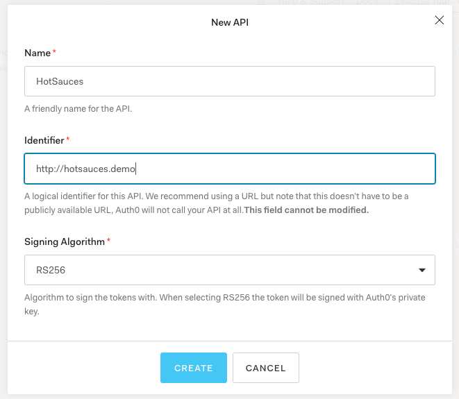
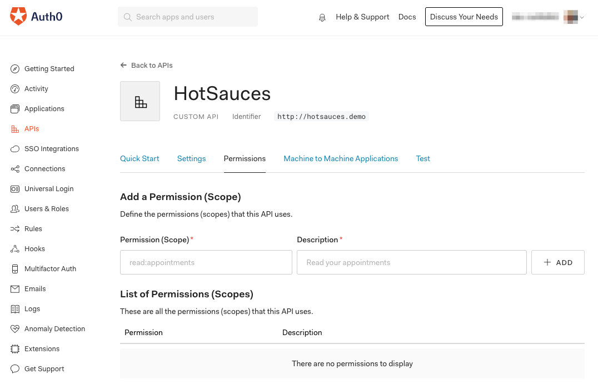
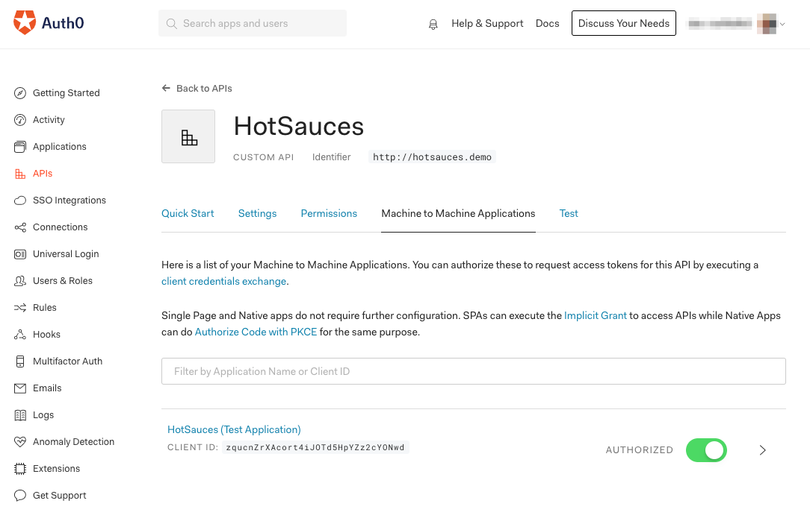

# Build and Secure an API with Spring Boot, Kotlin, and Auth0

Learn how to write a Spring Boot API in Kotlin and secure it with Auth0.


**TL;DR:** In this article, you’ll learn how to quickly build a RESTful API using the Spring Boot framework and the Kotlin programming language. Once you’ve done that, you’ll use Auth0 to secure the API so that only authenticated parties can   use its key functions. Along the way, you’ll learn the principles behind OAuth2, the protocol that powers Auth0. You can find the final code for the project developed throughout this article in [this GitHub repository](https://github.com/AccordionGuy/HotSauces).


## Spring Framework, Spring Boot, and Kotlin: An Overview

### Spring Framework


[Spring Framework](https://spring.io/projects/spring-framework), often shortened to just “Spring”, is a popular open source application framework for the Java platform. It’s built on the principle of [inversion of control](https://dzone.com/articles/understanding-inversion-of-control-and-dependency), whose name implies that control of a Spring application is quite different from the way program control happens in traditional software. Instead of your code directing the application and calling on functionality from a library or framework, the framework directs the application and calls on the functionality of your code.

This approach makes it possible to write an application as a collections of components, and the connections between them are maintained by Spring. There are also a lot of ready-built Spring components called *dependencies* that provide functionality that applications commonly require. The end result is a system for building applications that are modular, flexible, and easy to maintain — and in less time.

Spring is often described — especially by Java developers, who’ve grown used to working with unwieldy frameworks — as lightweight. It provides a set of built-in often-needed capabilities such as MVC, caching, messaging, security, and especially data access. It significantly reduces the amount of code you have to write and lets you focus on the features that are unique to your application.

While Spring is often used for web and server-based applications, it’s a general application framework, and it can be used to write desktop and mobile applications as well.

### Spring Boot


[Spring Boot](https://spring.io/projects/spring-boot) is a framework built on top of Spring that simplifies Spring development. It does this by enforcing an [opinionated](https://www.quora.com/What-is-a-Opinionated-Framework) approach to Spring application development through [“convention over configuration”](https://facilethings.com/blog/en/convention-over-configuration), the use of default setups that applications are likely to use, and a standardized application structure created by a generator that goes by the decidedly “Web 2.0” name of [Spring Initializr](https://www.tiobe.com/tiobe-index/). Thanks to its “it just works” approach, it’s propbably the fastest way to develop applications with the Spring framework.

### Kotlin


[Kotlin](https://kotlinlang.org/) is part of the wave of programming languages that appeared in the 2010s, which includes [Dart](https://dart.dev/), [Go](https://golang.org/), [Rust](https://www.rust-lang.org/), and [Swift](https://developer.apple.com/swift/). These languages have a number of common traits including their own takes on object-oriented programming from the lessons of the 1990s and functional programming from the lessons of the 2000s, inferred strong static typing, and meteoric rises in popularity (all of them are in [TIOBE’s index of popular programming languages](https://www.tiobe.com/tiobe-index/), and all of them except Kotlin are in the top 20).

As a programming language designed by [a company that makes developer tools](https://developer.apple.com/swift/), Kotlin is unique in its origin. It was designed to be an [improvement on Java](https://kotlinlang.org/docs/reference/comparison-to-java.html), with all the language features of [Scala](https://www.scala-lang.org/) (but faster compile times) and with the power and convenience that comes from interoperability with Java and the Java platform. It has grown to become the preferred language for Android app development; two-thirds of the top 1,000 Play Store apps were written in Kotlin. It’s also making serious inroads into web and enterprise development territory.

Since Spring and Spring Boot are based on the Java platform, you can use them to build applications using any JVM-based programming language, which includes Kotlin. If Java’s verbosity is bringing you down, or if you’re an Android developer who wants to use the same language to write the back end for your app, Spring and Spring Boot development in Kotlin is for you!


## What You’ll Build: A Hot Sauce API


The API you’ll build will be a catalog of hot sauces. It will be a simple one, exposing just a single resource named **hotsauces**. 

The API will provide endpoints for:

* Confirming that the API is active
* Getting a list of all the hot sauces in the catalog
* Getting the number of hot sauces in the catalog
* Adding a hot sauce to the catalog
* Editing any hot sauce in the catalog
* Deleting a hot sauce from the catalog

In the first part of the project, you’ll build the API. Once built, you’ll secure it so that the endpoints for CRUD operations will require authentication, while the endpoint for testing to see if the API is active will remain public.


## Prerequisites

To follow along with this article, you’ll need the following installed on your local machine:

* **[JDK 11](https://www.oracle.com/java/technologies/javase-jdk11-downloads.html)**
* Your favorite code editor.

You’ll also need internet access, as you’ll be using the Spring Initializr web page and the [Gradle](https://gradle.org/) build tool, which goes online to download project dependencies.


## Building the API

### Scaffolding with Spring Initializr

The preferred way to set up a new Spring Boot project is to use **[Spring Initializr](start.spring.io)**, a web application that generates a basic Spring Boot project, complete with all the necessary configurations, your choice of dependencies, and Gradle or Maven build files. It’s available online at [start.spring.io](https://start.spring.io/) and built into the Ultimate Edition of [IntelliJ IDEA](https://www.jetbrains.com/idea/).

You *could* create a new project manually using Spring Boot’s command-line interface, but Spring Initializr organizes its projects using a standardized directory layout for JVM-based projects. This makes your projects easier to maintain, and lets you focus on what your application actually *does*.

Point your favorite browser at the [Spring Initializr page](https://start.spring.io/):


Here’s how you should fill it out:

* *Project:* Select **Gradle Project**.
* *Language:* Select **Kotlin**.
* *Spring Boot:* Select **2.3.3**.
* *Project Metadata:*
	* *Group:* Enter **com.auth0**.
	* *Artifact:* Enter **hotsauces**.
	* *Name:* This will autofill; just use the value in this field.
	* *Description:* 
	* *Package name:* This will autofill; just use the value in this field.
	* *Packaging:* Select **Jar**.
	* *Java:* Select **11**.
* *Dependencies:* Tap the **ADD DEPENDENCIES...** button and choose the following:
	* **Spring Boot DevTools**: A set of convenient tools for development.
	* **Spring Web**: Provides a web server and facilities for building RESTfulweb applications and APIs.
	* **Spring Data JPA**: Makes the process of building a data access layer almost trivial.
	* **H2 Database**: This project will use the [H2](https://www.h2database.com/html/main.html) in-memory database.

Once filled out, the form should look like this:


With the form filled out, tap the **GENERATE** button. The site will generate a .zip file, which  and it will automatically be downloaded to your local machine.

Unzip the file to reveal the **hotsauces** project folder.


### Defining the Resource


The catalog stores the following attributes for each hot sauce:

<table>
	<tr>
		<th>Attribute</th>
		<th>Type</th>
		<th>Description</th>
	</tr>
	<tr>
		<td><code>id</code></td>
		<td>number</td>
		<td>The unique identifier for the hot sauce, and primary key.</td>
	</tr>
	<tr>
		<td><code>brandName</code></td>
		<td>string</td>
		<td>The name of the producer of the hot sauce.</td>
	</tr>
	<tr>
		<td><code>sauceName</code></td>
		<td>string</td>
		<td>The name of the hot sauce.</td>
	</tr>
	<tr>
		<td><code>description</code></td>
		<td>string</td>
		<td>A description of the hot sauce, with the appropriate keywords. This may be lengthy.</td>
	</tr>
	<tr>
		<td><code>url</code></td>
		<td>number</td>
		<td>The URL for the web page for the hot sauce.</td>
	</tr>
	<tr>
		<td><code>heat</code></td>
		<td>number</td>
		<td>The spiciness of the hot sauce, expressed in <a href="https://pepperheadsforlife.com/the-scoville-scale/">Scoville heat units (SHUs).</a></td>
	</tr>
</table>


```
// ./src/main/kotlin/com/auth0/hotsauces/HotSauce.kt

package com.auth0.hotsauces

import javax.persistence.Entity
import javax.persistence.GeneratedValue
import javax.persistence.GenerationType
import javax.persistence.Id
import javax.persistence.Lob


@Entity
data class HotSauce(

    // This property maps to the primary key in the database.
    @Id @GeneratedValue(strategy = GenerationType.AUTO)
    val id: Long = 0,

    // These properties are likely NOT to be longer than 256 characters.
    var brandName: String = "",
    var sauceName: String = "",

    // These properties might be longer than 256 characters.
    @Lob
    var description: String = "",
    @Lob
    var url: String = "",

    var heat: Int = 0

)
```

```
// ./src/main/kotlin/com/auth0/hotsauces/HotSauceRepository.kt

package com.auth0.hotsauces

import org.springframework.data.repository.PagingAndSortingRepository


interface HotSauceRepository: PagingAndSortingRepository<HotSauce, Long>
```

```
// ./src/main/kotlin/com/auth0/hotsauces/HotSauceController.kt

package com.auth0.hotsauces

import org.springframework.http.HttpStatus
import org.springframework.http.ResponseEntity
import org.springframework.web.bind.annotation.*


@RestController
@RequestMapping("/api/hotsauces")
class HotSauceController(private val hotSauceRepository: HotSauceRepository) {

@GetMapping("/test")
fun getHotSauce(): ResponseEntity<String> = ResponseEntity("Yup, it works!",  HttpStatus.OK)

}
```

```
// ./src/main/kotlin/com/auth0/hotsauces/HotSauceController.kt

package com.auth0.hotsauces

import org.springframework.http.HttpStatus
import org.springframework.http.ResponseEntity
import org.springframework.web.bind.annotation.*
import java.util.*


@RestController
@RequestMapping("/api/hotsauces")
class HotSauceController(private val hotSauceRepository: HotSauceRepository) {

    @GetMapping("/test")
    fun getHotSauce(): ResponseEntity<String> = ResponseEntity("Yup, it works!",  HttpStatus.OK)

    @GetMapping("")
    fun getAll(@RequestParam(required = false, defaultValue = "") brandNameFilter: String,
               @RequestParam(required = false, defaultValue = "") sauceNameFilter: String,
               @RequestParam(required = false, defaultValue = "") descFilter: String,
               @RequestParam(required = false, defaultValue = "") minHeat: String,
               @RequestParam(required = false, defaultValue = "") maxHeat: String): ResponseEntity<List<HotSauce>> {
        val MAX_SCOVILLE = 3_000_000 // At this point, it's no longer food, but a weapon
        val minHeatFilter = if (minHeat != "") minHeat.toInt() else 0
        val maxHeatFilter = if (maxHeat != "") maxHeat.toInt() else MAX_SCOVILLE
        return ResponseEntity(hotSauceRepository.findAll()
                .filter { it.brandName.contains(brandNameFilter, true) }
                .filter { it.sauceName.contains(sauceNameFilter, true) }
                .filter { it.description.contains(descFilter, true) }
                .filter { it.heat >= minHeatFilter }
                .filter { it.heat <= maxHeatFilter },
                HttpStatus.OK
        )
    }

    @GetMapping("/count")
    fun getCount(): ResponseEntity<Long> = ResponseEntity(hotSauceRepository.count(),
            HttpStatus.OK)

    @GetMapping("/{id}")
    fun getHotSauce(@PathVariable id: Long): ResponseEntity<Optional<HotSauce>> {
        if (hotSauceRepository.existsById(id)) {
            return ResponseEntity(hotSauceRepository.findById(id), HttpStatus.OK)
        } else {
            return ResponseEntity(HttpStatus.NOT_FOUND)
        }
    }

    @PostMapping()
    fun createHotSauce(@RequestBody hotSauce: HotSauce): ResponseEntity<HotSauce> {
        return ResponseEntity(hotSauceRepository.save(hotSauce), HttpStatus.CREATED)
    }

    @PutMapping("/{id}")
    fun updateHotSauce(@PathVariable id: Long, @RequestBody sauceChanges: HotSauce): ResponseEntity<HotSauce?> {
        if (hotSauceRepository.existsById(id)) {
            val originalSauce = hotSauceRepository.findById(id).get()
            val updatedSauce = HotSauce(
                    id = id,
                    brandName = if (sauceChanges.brandName != "") sauceChanges.brandName else originalSauce.brandName,
                    sauceName = if (sauceChanges.sauceName != "") sauceChanges.sauceName else originalSauce.sauceName,
                    description = if (sauceChanges.description != "") sauceChanges.description else originalSauce.description,
                    url = if (sauceChanges.url != "") sauceChanges.url else originalSauce.url,
                    heat = if (sauceChanges.heat != 0) sauceChanges.heat else originalSauce.heat
            )
            return ResponseEntity(hotSauceRepository.save(updatedSauce), HttpStatus.OK)
        } else {
            return ResponseEntity(HttpStatus.NOT_FOUND)
        }
    }

    @DeleteMapping("/{id}")
    fun deleteHotSauce(@PathVariable id: Long): ResponseEntity<HotSauce?> {
        if (hotSauceRepository.existsById(id)) {
            hotSauceRepository.deleteById(id)
            return ResponseEntity(HttpStatus.NO_CONTENT)
        } else {
            return ResponseEntity(HttpStatus.NOT_FOUND)
        }
    }

}
```

```
// ./src/main/kotlin/com/auth0/hotsauces/DataLoader.kt

package com.auth0.hotsauces

import org.springframework.stereotype.Component
import javax.annotation.PostConstruct


@Component
class DataLoader(var hotSauceRepository: HotSauceRepository) {

    fun String.trimIndentsAndRemoveNewlines() = this.trimIndent().replace("\n", " ")

    @PostConstruct
    fun loadData() {
        hotSauceRepository.saveAll(listOf(
            HotSauce(
                brandName = "Truff",
                sauceName = "Hot Sauce",
                description = """
                    Our sauce is a curated blend of ripe chili peppers, organic agave nectar, black truffle, and 
                    savory spices. This combination of ingredients delivers a flavor profile unprecedented to hot sauce.
                    """.trimIndentsAndRemoveNewlines(),
                url = "https://truffhotsauce.com/collections/sauce/products/truff",
                heat = 2_500
            ),
            HotSauce(
                brandName = "Truff",
                sauceName = "Hotter Sauce",
                description = """
                    TRUFF Hotter Sauce is a jalapeño rich blend of red chili peppers, Black Truffle and Black Truffle 
                    Oil, Organic Agave Nectar, Red Habanero Powder, Organic Cumin and Organic Coriander. Perfectly 
                    balanced and loaded with our same iconic flavor, TRUFF Hotter Sauce offers a “less sweet, more heat”
                    rendition of the Flagship original.
                    """.trimIndentsAndRemoveNewlines(),
                url = "https://truffhotsauce.com/collections/sauce/products/hotter-truff-hot-sauce",
                heat = 4_000
            ),
            HotSauce(
                brandName = "Cholula",
                sauceName = "Original",
                description = """
                    Cholula Original Hot Sauce is created from a generations old recipe that features carefully-selected
                    arbol and piquin peppers and a blend of signature spices. We love it on burgers and chicken but have
                    heard it’s amazing on pizza. Uncap Real Flavor with Cholula Original.
                    """.trimIndentsAndRemoveNewlines(),
                url = "https://www.cholula.com/original.html",
                heat = 3_600
            ),
            HotSauce(
                brandName = "Mad Dog",
                sauceName = "357",
                description = """
|                   Finally, a super hot sauce that tastes like real chile peppers. This sauce is blended
|                   with ingredients that create a sauce fit to take your breath away. About five seconds after you 
|                   taste the recommended dose of one drop, prepare your mouth and mind for five to 20 minutes of agony
|                   that all true chileheads fully understand and appreciate.
|                   """.trimIndentsAndRemoveNewlines(),
                url = "https://www.saucemania.com.au/mad-dog-357-hot-sauce-148ml/",
                heat = 357_000
            ),
            HotSauce(
                brandName = "Hot Ones",
                sauceName = "Fiery Chipotle",
                description = """
                    This hot sauce was created with one goal in mind: to get celebrity interviewees on Hot Ones to say 
                    "damn that's tasty, and DAMN that's HOT!" and then spill their deepest secrets to host Sean Evans.
                    The tongue tingling flavors of chipotle, pineapple and lime please the palate while the mix of ghost
                    and habanero peppers make this sauce a scorcher. Hot Ones Fiery Chipotle Hot Sauce is a spicy
                    masterpiece.
                    """.trimIndentsAndRemoveNewlines(),
                url = "https://chillychiles.com/products/hot-ones-fiery-chipotle-hot-sauce",
                heat = 15_600
            ),
            HotSauce(
                brandName = "Hot Ones",
                sauceName = "The Last Dab",
                description = """
                    More than simple mouth burn, Pepper X singes your soul. Starting with a pleasant burn in the mouth,
                    the heat passes quickly, lulling you into a false confidence. You take another bite, enjoying the
                    mustard and spice flavours. This would be great on jerk chicken, or Indian food! But then, WHAM!
                    All of a sudden your skin goes cold and your stomach goes hot, and you realize the power of X.
                    """.trimIndentsAndRemoveNewlines(),
                url = "https://www.saucemania.com.au/hot-ones-the-last-dab-hot-sauce-148ml/",
                heat = 1_000_000
            ),
            HotSauce(
                brandName = "Torchbearer",
                sauceName = "Zombie Apocalypse",
                description = """
                    The Zombie Apocalypse Hot Sauce lives up to its name, combining Ghost Peppers and Habaneros with a
                    mix of spices, vegetables, and vinegar to create a slow burning blow torch. Some people will feel
                    the heat right away, but others can take a few minutes for the full impact to set in. The heat can
                    last up to 20 minutes, creating a perfect match between very high heat and amazing flavor. Try it
                    on all your favorite foods - wings, chili, soups, steak or even a sandwich in need of a major kick.
                    """.trimIndentsAndRemoveNewlines(),
                url = "https://heatonist.com/products/zombie-apocalypse",
                heat = 100_000
            ),
            HotSauce(
                brandName = "Heartbeat",
                sauceName = "Pineapple Habanero",
                description = """
                    Pineapple Habanero is Heartbeat Hot Sauce’s most recent offering and their spiciest to date! They’ve
                    yet again collaborated with an Ontario craft brewery, this time from their home town of Thunder Bay.
                    Made with the help of Sleeping Giant Brewery’s award winning Beaver Duck session IPA, this sauce has
                    a boldly pronounced fruitiness and a bright but savoury vibe from start to finish.
                    """.trimIndentsAndRemoveNewlines(),
                url = "https://www.saucemania.com.au/heartbeat-pineapple-habanero-hot-sauce-177ml/",
                heat = 12_200
            ),
            HotSauce(
                brandName = "Karma Sauce",
                sauceName = "Burn After Eating",
                description = """
                    Karma Sauce Burn After Eating Hot Sauce is imbued with a unique flavour thanks to green mango,
                    ajwain and hing powder. Forged with a top-secret blend of super hots that may or may not include
                    Bhut Jolokia (Ghost), Scorpion, Carolina Reaper, 7-Pot Brown and 7-Pot Primo. This isn’t a sauce you
                    eat, it’s one you survive.
                    """.trimIndentsAndRemoveNewlines(),
                url = "https://www.saucemania.com.au/karma-sauce-burn-after-eating-hot-sauce-148ml/",
                heat = 669_000
            )
        ))
    }

}
```

## Authorize


```
# ./src/main/resources/application.yml

auth0:
  audience: http://hotsauces.demo
spring:
  security:
    oauth2:
      resourceserver:
        jwt:
          issuer-uri: https://dev-ne4fe9k3.us.auth0.com/
```

```
// Add the following lines to the dependencies block in
// ./build.gradle.kts

implementation("org.springframework.boot:spring-boot-starter-security")
implementation ("org.springframework.security:spring-security-oauth2-resource-server")
implementation ("org.springframework.security:spring-security-oauth2-jose")
implementation ("org.springframework.security:spring-security-config")
```


```
// ./src/main/kotlin/com/auth0/hotsauces/security/AudienceValidator.kt

package com.auth0.hotsauces.security

import org.springframework.security.oauth2.core.OAuth2Error
import org.springframework.security.oauth2.core.OAuth2TokenValidator
import org.springframework.security.oauth2.core.OAuth2TokenValidatorResult
import org.springframework.security.oauth2.jwt.Jwt


class AudienceValidator(private val audience: String) : OAuth2TokenValidator<Jwt> {

    override fun validate(jwt: Jwt): OAuth2TokenValidatorResult {
        val error = OAuth2Error("invalid_token", "The required audience is missing", null)
        return if (jwt.audience.contains(audience)) {
            OAuth2TokenValidatorResult.success()
        } else OAuth2TokenValidatorResult.failure(error)
    }

}
```

```
// ./src/main/kotlin/com/auth0/hotsauces/security/SecurityConfig.kt

package com.auth0.hotsauces.security

import org.springframework.beans.factory.annotation.Value
import org.springframework.context.annotation.Bean
import org.springframework.security.config.annotation.web.builders.HttpSecurity
import org.springframework.security.config.annotation.web.configuration.EnableWebSecurity
import org.springframework.security.config.annotation.web.configuration.WebSecurityConfigurerAdapter
import org.springframework.security.oauth2.core.DelegatingOAuth2TokenValidator
import org.springframework.security.oauth2.core.OAuth2TokenValidator
import org.springframework.security.oauth2.jwt.*


@EnableWebSecurity
class SecurityConfig : WebSecurityConfigurerAdapter() {

    @Value("\${auth0.audience}")
    private val audience: String? = null

    @Value("\${spring.security.oauth2.resourceserver.jwt.issuer-uri}")
    private val issuer: String? = null

    @Bean
    fun jwtDecoder(): JwtDecoder {
        val jwtDecoder = JwtDecoders.fromOidcIssuerLocation(issuer) as NimbusJwtDecoder
        val audienceValidator: OAuth2TokenValidator<Jwt> = AudienceValidator(audience!!)
        val withIssuer: OAuth2TokenValidator<Jwt> = JwtValidators.createDefaultWithIssuer(issuer)
        val withAudience: OAuth2TokenValidator<Jwt> = DelegatingOAuth2TokenValidator(withIssuer, audienceValidator)
        jwtDecoder.setJwtValidator(withAudience)
        return jwtDecoder
    }

    @Throws(Exception::class)
    override fun configure(http: HttpSecurity) {
        http.authorizeRequests()
            .mvcMatchers("/api/hotsauces/test").permitAll()
            .mvcMatchers("/api/hotsauces").authenticated()
            .mvcMatchers("/api/hotsauces/*").authenticated()
            .and()
            .oauth2ResourceServer().jwt()
    }
}
```

```
$ curl get http://localhost:8080/api/hotsauces/test
Yup, it works!
```

```
$ curl get http://localhost:8080
```









